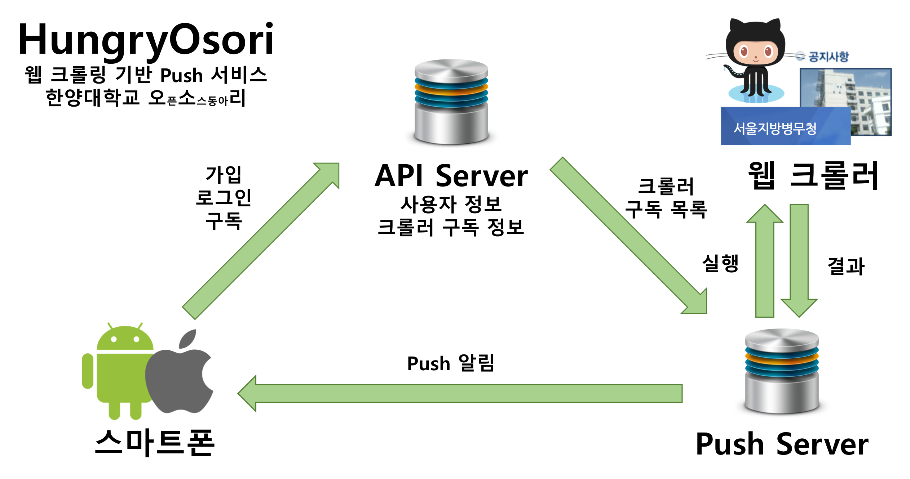

# HungryOsori
HungryOsori는 웹 크롤링 기반 Push 서비스입니다. 웹에서 컨텐츠가 변하면, 스마트폰 Push로 알려줍니다.

## Overview



HungryOsori는 웹 크롤링 기반 Push 서비스 플랫폼입니다. 현재 Android와 IOS에서 구동 가능합니다. 

* Crawler GitHub
 Crawler GitHub( https://github.com/HyOsori/Osori-WebCrawler )는 오픈소스 플랫폼인 HungryOsori에서 중요한 부분입니다. 오픈소스 유저들의 커밋을 통해 올라온 크롤러들은 Push서버에서 주기적으로 실행됩니다. 오픈소스 Scrapy를 이용해 개발했습니다. 추후 Readme 파일 업데이트를 통해 가이드라인을 올릴 예정입니다.
* 서버
	서버는 Django를 이용했습니다. DB는 MYSQL를 이용했습니다.
	또한 Restful FrameWork를 이용해 같은 URL로 다른 메소드를 통해 다른 함수를 사용할 수 있습니다.
	* Push 서버
		Push서버에서는 Crawler GitHub에서 크롤러들을 받습니다. 또한 API서버에서 사용자가 구독하고 있는 크롤러 ID와 사용자 디바이스의 토큰을 받아옵니다. Push 서버에서는 DB에 주기적으로 크롤링한 데이터들을 저장한 후 만약 변동사항이 있으면(새로운 업데이트가 발생하면) PYFCM으로 API에서 받아온 토큰과 구독 크롤러 ID를 이용해 푸시를 보내줍니다. 
	* API 서버
		API서버는 전체적인 어플리케이션의 구동을 담당하고 있습니다. HungryOsori는 플랫폼 형태이기 때문에, 로그인을 하여 자신이 정보를 지속적으로 받기를 원하는 크롤러를 구독할 수 있는데, API서버는 이와 관련된 Android/IOS 어플리케이션에서의 유저 등록과 크롤러 구독을 처리하고 있습니다. 유저가 로그인 할때 푸시토큰을 서버가 받으며, 이 푸시토큰과 유저가 크롤링한 크롤러 ID를 수집해 Push서버로 보내줍니다. 또한 User의 정보를 수정할 수 있는데, 다른 Method를 이용해서 유저의 비밀번호 변경과, 비밀번호 찾기를 수행할 수 있습니다. 가입과 비밀번호 찾기 시에는 가입한 이메일로 메일을 보내 확인합니다.
* Android
	Android에서는 API서버와 통신하여 유저 등록과 로그인을 수행할 수 있습니다. 이 때 로그인한 정보는 쿠키로 저장되어 이후 로그인을 할 떄 쿠키정보를 이용해 자동로그인을 수행합니다. 또한 구독 및 구독해제 요청을 API 서버에 보낼 수 있습니다. 또한 FCM을 이용해 Push 서버에서 보낸 푸시 메시지와 URL을 받아 URL로 갈 수 있는 알림을 띄웁니다. 안드로이드에서는 반응형 앱을 위해, Scalable Layout이라는 오픈 소스 레이아웃을 사용해 스크린크기와 상관없이 UI를 띄울 수 있습니다. 또한 Universal Image Loader를 이용해 섬네일 이미지를 받아 올 수 있습니다.
	
## Source
* [Osori-WebCrawler](https://github.com/HyOsori/Osori-WebCrawler) : 웹의 변화를 감지하는 크롤러를 올리는 레포
* [HungryOsori-iOS](https://github.com/HyOsori/HungryOsori-iOS) : iOS 앱
* [HungryOsori-Android](https://github.com/HyOsori/HungryOsori-Android) : Android 앱
* [HungryOsori-Server](https://github.com/HyOsori/HungryOsori-Server) : 회원관리, 크롤러 구독을 위한 서버 
* [HungryOsori-PushServer](https://github.com/HyOsori/HungryOsori-PushServer) : 웹의 변화를 확인하고, Push 메시지를 발송하는 서버
* [HungryOsori-TestServer](https://github.com/HyOsori/HungryOsori-TestServer) : 테스트를 위해 만든 서버 

## Contributors
### Android
* [GunjuKo](https://github.com/GunjuKo)
* [kkyumin](https://github.com/kkyumin)

### iOS
* [kanak87](https://github.com/kanak87)
* [seubseub](https://github.com/seubseub)

### Push Server
* [jhwon0415](https://github.com/jhwon0415)
* [CameliaOvO](https://github.com/CameliaOvO)
* [doomsheart](https://github.com/doomsheart)

### API Server
* [knunu](https://github.com/knunu)
* [bees1114](https://github.com/bees1114)

## License
```
The MIT License (MIT)

Copyright (c) 2016 Hanyang Osori

Permission is hereby granted, free of charge, to any person obtaining a copy
of this software and associated documentation files (the "Software"), to deal
in the Software without restriction, including without limitation the rights
to use, copy, modify, merge, publish, distribute, sublicense, and/or sell
copies of the Software, and to permit persons to whom the Software is
furnished to do so, subject to the following conditions:

The above copyright notice and this permission notice shall be included in all
copies or substantial portions of the Software.

THE SOFTWARE IS PROVIDED "AS IS", WITHOUT WARRANTY OF ANY KIND, EXPRESS OR
IMPLIED, INCLUDING BUT NOT LIMITED TO THE WARRANTIES OF MERCHANTABILITY,
FITNESS FOR A PARTICULAR PURPOSE AND NONINFRINGEMENT. IN NO EVENT SHALL THE
AUTHORS OR COPYRIGHT HOLDERS BE LIABLE FOR ANY CLAIM, DAMAGES OR OTHER
LIABILITY, WHETHER IN AN ACTION OF CONTRACT, TORT OR OTHERWISE, ARISING FROM,
OUT OF OR IN CONNECTION WITH THE SOFTWARE OR THE USE OR OTHER DEALINGS IN THE
SOFTWARE.
```
